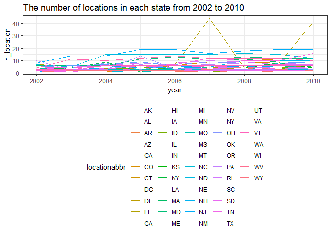
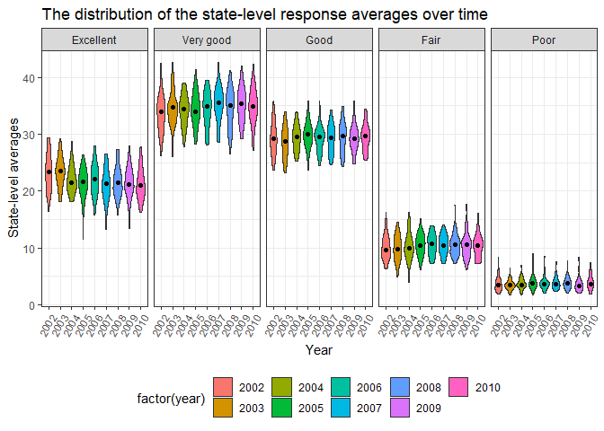
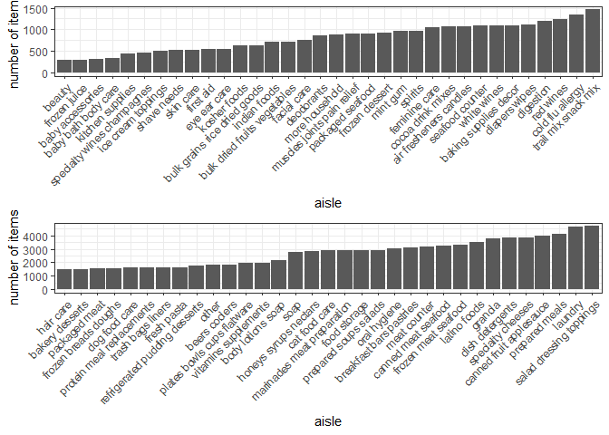

p8105\_hw3\_yh3094
================
Yun He
October 5, 2018

Problem 1
=========

Import the BRFSS data
---------------------

``` r
devtools::install_github("p8105/p8105.datasets")
```

    ## Skipping install of 'p8105.datasets' from a github remote, the SHA1 (21f5ad1c) has not changed since last install.
    ##   Use `force = TRUE` to force installation

``` r
library(p8105.datasets)
data("brfss_smart2010")
```

Clean the BRFSS data
--------------------

``` r
brfss_data = brfss_smart2010 %>% 
  janitor::clean_names() %>% 
  filter(topic == "Overall Health") %>% 
  mutate(response = as.factor(response))
```

Pick out the states observed at 7 locations in 2002
---------------------------------------------------

``` r
brfss_data %>% 
  filter(year == 2002) %>% 
  group_by(locationabbr) %>% 
  summarize(n_location = n_distinct(locationdesc)) %>%
  filter(n_location == 7)
```

    ## # A tibble: 3 x 2
    ##   locationabbr n_location
    ##   <chr>             <int>
    ## 1 CT                    7
    ## 2 FL                    7
    ## 3 NC                    7

In 2002, CT, FL and NC were observed at 7 locations.

Make a “spaghetti plot”
-----------------------

The code chunk below makes a “spaghetti plot” which shows the number of observations in each state from 2002 to 2010.

``` r
brfss_data %>% 
  group_by(year, locationabbr) %>% 
  summarize(n_observation = sum(sample_size)) %>% 
  ggplot(aes(x = year, y = n_observation, color = locationabbr)) +
  geom_line() +
  labs(title = "The spaghetti plot")
```



The number of observations didn't change a lot over the years in most states, although some states, like FL, MA and WA, have the number of observations changing from thousands to ten thousands.

Make a table
------------

The code chunk below makes a table showing, for the years 2002, 2006, and 2010, the mean and standard deviation of the proportion of “Excellent” responses across locations in NY State.

``` r
brfss_data %>% 
  filter(locationabbr == "NY") %>% 
  filter(year == 2002 | year == 2006 | year == 2010) %>% 
  filter(response == "Excellent") %>% 
  group_by(year) %>% 
  summarise(
    mean_excellent = round(mean(data_value, na.rm = TRUE), digits = 1), 
    sd_excellent = round(sd(data_value, na.rm = TRUE), digits = 1)) %>%
  knitr::kable()
```

|  year|  mean\_excellent|  sd\_excellent|
|-----:|----------------:|--------------:|
|  2002|             24.0|            4.5|
|  2006|             22.5|            4.0|
|  2010|             22.7|            3.6|

The mean of the proportion of “Excellent” responses across locations in NY State decreased in 2006 and then increased a little bit in 2010. The standard deviation of the proportion of “Excellent” responses across locations in NY State showed a decreasing trend from 2002 to 2010.

Compute the average proportion in each response category for each year and state
--------------------------------------------------------------------------------

``` r
brfss_data %>% 
  group_by(year, locationabbr, response) %>% 
  summarize(mean_response_proportion = round(mean(data_value, na.rm = TRUE), digits = 1)) 
```

    ## # A tibble: 2,215 x 4
    ## # Groups:   year, locationabbr [?]
    ##     year locationabbr response  mean_response_proportion
    ##    <int> <chr>        <fct>                        <dbl>
    ##  1  2002 AK           Excellent                     27.9
    ##  2  2002 AK           Fair                           8.6
    ##  3  2002 AK           Good                          23.8
    ##  4  2002 AK           Poor                           5.9
    ##  5  2002 AK           Very good                     33.7
    ##  6  2002 AL           Excellent                     18.5
    ##  7  2002 AL           Fair                          12.1
    ##  8  2002 AL           Good                          32.7
    ##  9  2002 AL           Poor                           5.9
    ## 10  2002 AL           Very good                     30.9
    ## # ... with 2,205 more rows

Make a five-panel plot
----------------------

The code chunk below makes a five-panel plot that shows, for each response category separately, the distribution of these state-level averages over time.

``` r
brfss_data %>% 
  group_by(year, locationabbr, response) %>% 
  summarize(mean_response_proportion = round(mean(data_value, na.rm = TRUE), digits = 1)) %>% 
  ggplot(aes(x = year, y = mean_response_proportion, color = locationabbr)) +
  facet_grid(~response) +
  geom_line() +
  labs(title = "The five-panel plot")
```



Almost in all states, the average proportion of “Very good” responses is the largest compared with other response categories, and the average proportion of “Poor” responses is the smallest. The average proportion of each response category changed over time with no regular pattern.

Problem 2
=========

Import the Instacart data
-------------------------

``` r
data("instacart")
instacart = janitor::clean_names(instacart) ## clean variable names
```

Calculate the number of aisles and find out the most frequent
-------------------------------------------------------------

``` r
n_distinct(instacart$aisle) ## number of aisles
```

    ## [1] 134

``` r
instacart %>% 
  count(aisle) %>% 
  mutate(aisle_ranking = min_rank(desc(n))) %>% 
  filter(aisle_ranking == 1)
```

    ## # A tibble: 1 x 3
    ##   aisle                 n aisle_ranking
    ##   <chr>             <int>         <int>
    ## 1 fresh vegetables 150609             1

There are 134 aisles. Fresh vegetables is the aisle which the most items ordered from.

Make a plot
-----------

The code chunk below makes a plot that shows the number of items ordered in each aisle. Order aisles sensibly, and organize your plot so others can read it.

``` r
instacart %>% 
  group_by(department, aisle) %>% 
  summarise(n_item = sum(order_number)) %>% 
  ggplot(aes(x = aisle, y = n_item, color = aisle)) +
  geom_point() +
  facet_grid(~department)
```



Make a table
------------

The code chunk below makes a table showing the most popular item aisles “baking ingredients”, “dog food care”, and “packaged vegetables fruits”.

Make a table
------------

The code chunk below makes a table showing the mean hour of the day at which Pink Lady Apples and Coffee Ice Cream are ordered on each day of the week.

``` r
instacart %>% 
  filter(product_name == "Pink Lady Apples" | product_name == "Coffee Ice Cream") %>%
  group_by(product_name, order_dow) %>% 
  summarize(mean_time = round(mean(order_hour_of_day, na.rm = TRUE), digits = 1)) %>% 
  spread(key = order_dow, value = mean_time) %>% 
  knitr::kable()
```

| product\_name    |     0|     1|     2|     3|     4|     5|     6|
|:-----------------|-----:|-----:|-----:|-----:|-----:|-----:|-----:|
| Coffee Ice Cream |  13.8|  14.3|  15.4|  15.3|  15.2|  12.3|  13.8|
| Pink Lady Apples |  13.4|  11.4|  11.7|  14.2|  11.6|  12.8|  11.9|

Problem 3
=========

Import the NY NOAA data
-----------------------

``` r
data("ny_noaa")
ny_noaa = janitor::clean_names(ny_noaa) ## clean variable names
```
