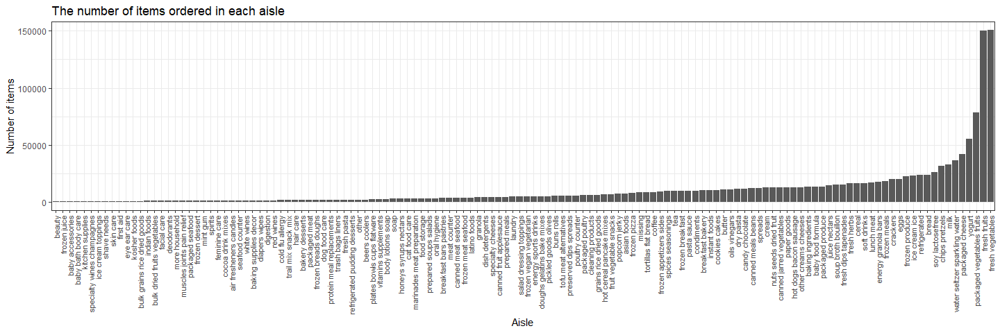
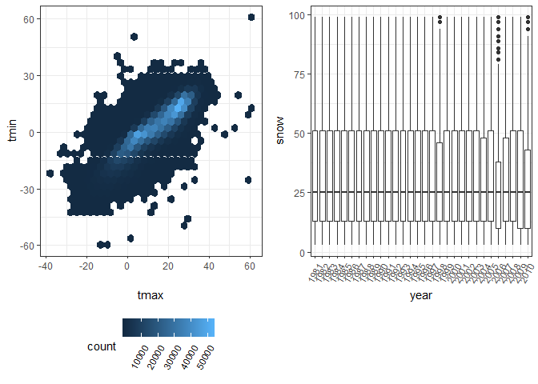

p8105\_hw3\_yh3094
================
Yun He
October 5, 2018

Problem 1
=========

Import the BRFSS data
---------------------

``` r
devtools::install_github("p8105/p8105.datasets")
```

    ## Skipping install of 'p8105.datasets' from a github remote, the SHA1 (21f5ad1c) has not changed since last install.
    ##   Use `force = TRUE` to force installation

``` r
library(p8105.datasets)
data("brfss_smart2010")
```

Clean the BRFSS data
--------------------

``` r
brfss_data = brfss_smart2010 %>% 
  janitor::clean_names() %>% 
  filter(topic == "Overall Health") %>% 
  filter(response %in% c("Excellent", "Very good", "Good", "Fair", "Poor")) %>% 
  mutate(response = factor(response, levels = c("Excellent", "Very good", "Good", "Fair", "Poor")))
```

Pick out the states observed at 7 locations in 2002
---------------------------------------------------

``` r
brfss_data %>% 
  filter(year == 2002) %>% 
  group_by(locationabbr) %>% 
  summarize(n_location = n_distinct(locationdesc)) %>%
  filter(n_location == 7)
```

    ## # A tibble: 3 x 2
    ##   locationabbr n_location
    ##   <chr>             <int>
    ## 1 CT                    7
    ## 2 FL                    7
    ## 3 NC                    7

In 2002, CT, FL and NC were observed at 7 locations.

Make a “spaghetti plot”
-----------------------

The code chunk below makes a “spaghetti plot” which shows the number of observations in each state from 2002 to 2010.

``` r
brfss_data %>% 
  group_by(year, locationabbr) %>% 
  summarize(n_observation = sum(sample_size)) %>% 
  ggplot(aes(x = year, y = n_observation, color = locationabbr)) +
  geom_line() +
  labs(title = "The spaghetti plot")
```


The number of observations didn't change a lot over the years in most states, although some states, like FL, MA and WA, have the number of observations changing from thousands to ten thousands.

Make a table
------------

The code chunk below makes a table showing, for the years 2002, 2006, and 2010, the mean and standard deviation of the proportion of “Excellent” responses across locations in NY State.

``` r
brfss_data %>% 
  filter(
    locationabbr == "NY", year %in% c("2002", "2006", "2010"), response == "Excellent"
  ) %>%
  group_by(year) %>% 
  summarise(
    mean_excellent = mean(data_value, na.rm = TRUE), 
    sd_excellent = sd(data_value, na.rm = TRUE)) %>%
  knitr::kable(digits = 1)
```

|  year|  mean\_excellent|  sd\_excellent|
|-----:|----------------:|--------------:|
|  2002|             24.0|            4.5|
|  2006|             22.5|            4.0|
|  2010|             22.7|            3.6|

The mean of the proportion of “Excellent” responses across locations in NY State decreased in 2006 and then increased a little bit in 2010. The standard deviation of the proportion of “Excellent” responses across locations in NY State showed a decreasing trend from 2002 to 2010.

Compute the average proportion in each response category for each year and state
--------------------------------------------------------------------------------

``` r
brfss_data %>% 
  group_by(year, locationabbr, response) %>% 
  summarize(mean_response_proportion = round(mean(data_value, na.rm = TRUE), digits = 1)) 
```

    ## # A tibble: 2,215 x 4
    ## # Groups:   year, locationabbr [?]
    ##     year locationabbr response  mean_response_proportion
    ##    <int> <chr>        <fct>                        <dbl>
    ##  1  2002 AK           Excellent                     27.9
    ##  2  2002 AK           Very good                     33.7
    ##  3  2002 AK           Good                          23.8
    ##  4  2002 AK           Fair                           8.6
    ##  5  2002 AK           Poor                           5.9
    ##  6  2002 AL           Excellent                     18.5
    ##  7  2002 AL           Very good                     30.9
    ##  8  2002 AL           Good                          32.7
    ##  9  2002 AL           Fair                          12.1
    ## 10  2002 AL           Poor                           5.9
    ## # ... with 2,205 more rows

Make a five-panel plot
----------------------

The code chunk below makes a five-panel plot that shows, for each response category separately, the distribution of these state-level averages over time.

``` r
brfss_data %>% 
  group_by(year, locationabbr, response) %>% 
  summarize(mean_response_proportion = mean(data_value, na.rm = TRUE)) %>% 
  ggplot(aes(x = factor(year), y = mean_response_proportion)) +
  facet_grid(~response) +
  geom_violin(aes(fill = factor(year))) +
  stat_summary(fun.y = median, geom = "point", size = 2) +
  labs(title = "The five-panel plot")
```


The state-level average proportion of “Very good” responses remained highest compared with that of other response categories over time. And the state-level average proportion of “Poor” responses remained lowest over time. For all response categories, these state-level averages didn't change much over time.

Problem 2
=========

Import the Instacart data
-------------------------

``` r
data("instacart")
instacart = janitor::clean_names(instacart) ## clean variable names
skimr::skim(instacart)
```

    ## Skim summary statistics
    ##  n obs: 1384617 
    ##  n variables: 15 
    ## 
    ## -- Variable type:character --------------------------------------------------------------------
    ##      variable missing complete       n min max empty n_unique
    ##         aisle       0  1384617 1384617   3  29     0      134
    ##    department       0  1384617 1384617   4  15     0       21
    ##      eval_set       0  1384617 1384617   5   5     0        1
    ##  product_name       0  1384617 1384617   3 159     0    39123
    ## 
    ## -- Variable type:integer ----------------------------------------------------------------------
    ##                variable missing complete       n       mean        sd p0
    ##       add_to_cart_order       0  1384617 1384617       8.76      7.42  1
    ##                aisle_id       0  1384617 1384617      71.3      38.1   1
    ##  days_since_prior_order       0  1384617 1384617      17.07     10.43  0
    ##           department_id       0  1384617 1384617       9.84      6.29  1
    ##               order_dow       0  1384617 1384617       2.7       2.17  0
    ##       order_hour_of_day       0  1384617 1384617      13.58      4.24  0
    ##                order_id       0  1384617 1384617 1706297.62 989732.65  1
    ##            order_number       0  1384617 1384617      17.09     16.61  4
    ##              product_id       0  1384617 1384617   25556.24  14121.27  1
    ##               reordered       0  1384617 1384617       0.6       0.49  0
    ##                 user_id       0  1384617 1384617   1e+05     59487.15  1
    ##     p25     p50     p75    p100     hist
    ##       3       7      12      80 <U+2587><U+2583><U+2581><U+2581><U+2581><U+2581><U+2581><U+2581>
    ##      31      83     107     134 <U+2583><U+2587><U+2583><U+2583><U+2587><U+2585><U+2585><U+2586>
    ##       7      15      30      30 <U+2582><U+2585><U+2583><U+2583><U+2581><U+2582><U+2581><U+2587>
    ##       4       8      16      21 <U+2583><U+2587><U+2582><U+2581><U+2582><U+2586><U+2581><U+2583>
    ##       1       3       5       6 <U+2587><U+2585><U+2583><U+2583><U+2581><U+2583><U+2585><U+2585>
    ##      10      14      17      23 <U+2581><U+2581><U+2583><U+2587><U+2587><U+2587><U+2585><U+2582>
    ##  843370 1701880 2568023 3421070 <U+2587><U+2587><U+2587><U+2587><U+2587><U+2587><U+2587><U+2587>
    ##       6      11      21     100 <U+2587><U+2582><U+2581><U+2581><U+2581><U+2581><U+2581><U+2581>
    ##   13380   25298   37940   49688 <U+2586><U+2586><U+2587><U+2587><U+2587><U+2586><U+2587><U+2587>
    ##       0       1       1       1 <U+2586><U+2581><U+2581><U+2581><U+2581><U+2581><U+2581><U+2587>
    ##   51732   1e+05  154959  206209 <U+2587><U+2587><U+2587><U+2587><U+2587><U+2587><U+2587><U+2587>

write a short description of the dataset, noting the size and structure of the data, describing some key variables, and giving illstrative examples of observations.

The Instacart data has 1384617 observations and 15 variables. Variables for `aisle`, `department`, `eval_set` and `product_name` are class `character` and other variables are class `integer`. The dataset contains products of 39,123 different names bought from 134 different aisles within 21 departments. 0.6 of all items ordered have been ordered by the user in the past. Among those items which have been ordered before, Banana is the most popular. Most orders were placed at 14 ± 4.2 hours of the day.

The distribution of orders placed at which day of the week are shown below.

``` r
instacart %>% 
  count(order_dow) %>% 
  ggplot(aes(x = factor(order_dow), y = n)) + geom_bar(stat = "identity")
```


Calculate the number of aisles and find out the most frequent
-------------------------------------------------------------

``` r
n_distinct(instacart$aisle) ## number of aisles
```

    ## [1] 134

``` r
instacart %>% 
  count(aisle) %>% 
  top_n(1)
```

    ## Selecting by n

    ## # A tibble: 1 x 2
    ##   aisle                 n
    ##   <chr>             <int>
    ## 1 fresh vegetables 150609

There are 134 aisles. Fresh vegetables is the aisle which the most items ordered from.

Make a plot
-----------

The code chunk below makes a plot that shows the number of items ordered in each aisle. Order aisles sensibly, and organize your plot so others can read it.

Solution a

``` r
instacart %>%
  count(aisle) %>%
  pull(n) %>% 
  quantile
```

    ##       0%      25%      50%      75%     100% 
    ##    287.0   1464.5   4723.0  12020.0 150609.0

``` r
aisle_p1 = 
  instacart %>%
  count(aisle) %>%
  filter(n %in% quantile(n, 0):quantile(n, 0.25)) %>% 
  ggplot(aes(x = forcats::fct_reorder(aisle, n), y = n)) +
  geom_bar(stat = "identity") +
  labs(x = "aisle", y = "number of items") +
  theme(axis.text.x = element_text(angle = 45, hjust = 1))


aisle_p2 = 
  instacart %>%
  count(aisle) %>% 
  filter(n %in% 1464:4723) %>% 
  ggplot(aes(x = forcats::fct_reorder(aisle, n), y = n)) +
  geom_bar(stat = "identity") +
  labs(x = "aisle", y = "number of items") +
  theme(axis.text.x = element_text(angle = 45, hjust = 1))

aisle_p3 =
  instacart %>%
  count(aisle) %>%
  filter(n %in% quantile(n, 0.5):quantile(n, 0.75)) %>% 
  ggplot(aes(x = forcats::fct_reorder(aisle, n), y = n)) +
  geom_bar(stat = "identity") +
  labs(x = "aisle", y = "number of items") +
  theme(axis.text.x = element_text(angle = 45, hjust = 1))

aisle_p4 =
  instacart %>%
  count(aisle) %>%
  filter(n %in% quantile(n, 0.75):quantile(n, 1)) %>% 
  ggplot(aes(x = forcats::fct_reorder(aisle, n), y = n)) +
  geom_bar(stat = "identity") +
  labs(x = "aisle", y = "number of items") +
  theme(axis.text.x = element_text(angle = 45, hjust = 1))

aisle_p1/aisle_p2/aisle_p3/aisle_p4
```



Solution b

``` r
instacart %>% 
  count(aisle) %>% 
  ggplot(aes(x = n)) +
  geom_histogram() +
  labs(x = "Number of items", y = "Number of aisles")
```

    ## `stat_bin()` using `bins = 30`. Pick better value with `binwidth`.


``` r
instacart %>% 
  count(aisle) %>% 
  top_n(3)
```

    ## Selecting by n

    ## # A tibble: 3 x 2
    ##   aisle                           n
    ##   <chr>                       <int>
    ## 1 fresh fruits               150473
    ## 2 fresh vegetables           150609
    ## 3 packaged vegetables fruits  78493

The number of items ordered in most aisles are below 25,000, although in some aisles, like "fresh fruits" and "fresh vegetables", the number of items ordered are quite large, more than 150,000.

Make a table
------------

The code chunk below makes a table showing the most popular item aisles “baking ingredients”, “dog food care”, and “packaged vegetables fruits”.

``` r
instacart %>% 
  filter(aisle %in% c("baking ingredients", "dog food care", "packaged vegetables fruits")) %>% 
  group_by(aisle) %>% 
  count(product_name) %>% 
  top_n(1) %>% 
  rename("the most popular item" = "product_name") %>% 
  select(-n) %>% 
  knitr::kable() 
```

    ## Selecting by n

| aisle                      | the most popular item                         |
|:---------------------------|:----------------------------------------------|
| baking ingredients         | Light Brown Sugar                             |
| dog food care              | Snack Sticks Chicken & Rice Recipe Dog Treats |
| packaged vegetables fruits | Organic Baby Spinach                          |

The most popular items aisle “baking ingredients”, “dog food care”, and “packaged vegetables fruits” are Light Brown Sugar, Snack Sticks Chicken & Rice Recipe Dog Treats and Organic Baby Spinach, respectively.

Make a table
------------

The code chunk below makes a table showing the mean hour of the day at which Pink Lady Apples and Coffee Ice Cream are ordered on each day of the week.

``` r
instacart %>% 
  filter(product_name == "Pink Lady Apples" | product_name == "Coffee Ice Cream") %>%
  group_by(product_name, order_dow) %>% 
  summarize(mean_time = round(mean(order_hour_of_day, na.rm = TRUE), digits = 1)) %>% 
  spread(key = order_dow, value = mean_time) %>% 
  knitr::kable()
```

| product\_name    |     0|     1|     2|     3|     4|     5|     6|
|:-----------------|-----:|-----:|-----:|-----:|-----:|-----:|-----:|
| Coffee Ice Cream |  13.8|  14.3|  15.4|  15.3|  15.2|  12.3|  13.8|
| Pink Lady Apples |  13.4|  11.4|  11.7|  14.2|  11.6|  12.8|  11.9|

On most days of a week, the mean hour at which Pink Lady Apples is ordered is earlier than that and at which Coffee Ice Cream is ordered.

Problem 3
=========

Import the NY NOAA data
-----------------------

``` r
data("ny_noaa")
ny_noaa = janitor::clean_names(ny_noaa) ## clean variable names
skimr::skim(ny_noaa)
```

    ## Skim summary statistics
    ##  n obs: 2595176 
    ##  n variables: 7 
    ## 
    ## -- Variable type:character --------------------------------------------------------------------
    ##  variable missing complete       n min max empty n_unique
    ##        id       0  2595176 2595176  11  11     0      747
    ##      tmax 1134358  1460818 2595176   1   4     0      532
    ##      tmin 1134420  1460756 2595176   1   4     0      548
    ## 
    ## -- Variable type:Date -------------------------------------------------------------------------
    ##  variable missing complete       n        min        max     median
    ##      date       0  2595176 2595176 1981-01-01 2010-12-31 1997-01-21
    ##  n_unique
    ##     10957
    ## 
    ## -- Variable type:integer ----------------------------------------------------------------------
    ##  variable missing complete       n  mean     sd  p0 p25 p50 p75  p100
    ##      prcp  145838  2449338 2595176 29.82  78.18   0   0   0  23 22860
    ##      snow  381221  2213955 2595176  4.99  27.22 -13   0   0   0 10160
    ##      snwd  591786  2003390 2595176 37.31 113.54   0   0   0   0  9195
    ##      hist
    ##  <U+2587><U+2581><U+2581><U+2581><U+2581><U+2581><U+2581><U+2581>
    ##  <U+2587><U+2581><U+2581><U+2581><U+2581><U+2581><U+2581><U+2581>
    ##  <U+2587><U+2581><U+2581><U+2581><U+2581><U+2581><U+2581><U+2581>

Write a short description of the dataset, noting the size and structure of the data, describing some key variables, and indicating the extent to which missing data is an issue.

The NY NOAA data has 2595176 observations and 7 variables. Variables for `id`, `tmax` and `tmin` are class `character`. Variables for `prcp`, `snow` and `snwd` are class `integer`. Variable for `date` is class `Date`.

Clean the NY NOAA data
----------------------

``` r
ny_noaa = ny_noaa %>% 
  separate(col = date, into = c("year", "month", "day"), sep = "-")
ny_noaa$tmax = as.numeric(ny_noaa$tmax)
ny_noaa$tmin = as.numeric(ny_noaa$tmin)
```

The most commonly observed value for snowfall
---------------------------------------------

``` r
ny_noaa %>% 
  count(snow) %>% 
  top_n(1)
```

    ## Selecting by n

    ## # A tibble: 1 x 2
    ##    snow       n
    ##   <int>   <int>
    ## 1     0 2008508

0 is the most commonly observed value for snowfall. Because for most of the time between 1981-01-01 and 2010-12-31, it didn't snow in NY state.

Make a two-panel plot
---------------------

The code chunk below makes a two-panel plot showing the average max temperature in January and in July in each station across years.

``` r
ny_noaa %>% 
  filter(month %in% c("01", "07")) %>% 
  group_by(month, id, year) %>%
  summarize(tmax_mean = mean(tmax, na.rm = T)) %>%
  ggplot(aes(x = year, y = tmax_mean, fill = year)) +
  geom_violin() +
  facet_grid(~month)
```

    ## Warning: Removed 5970 rows containing non-finite values (stat_ydensity).


Make a two-panel plot
---------------------

The code chunk below makes a two-panel plot showing (i) tmax vs tmin for the full dataset (note that a scatterplot may not be the best option); and (ii) make a plot showing the distribution of snowfall values greater than 0 and less than 100 separately by year

``` r
tmax_tmin = ny_noaa %>% 
  ggplot(aes(x = tmax, y = tmin)) +
  geom_hex()

snowfall = ny_noaa %>% 
  filter(snow > 0 & snow < 100) %>% 
  group_by(year) %>% 
  ggplot(aes(x = year, y = snow)) +
  geom_boxplot()

tmax_tmin + snowfall
```

    ## Warning: Removed 1136276 rows containing non-finite values (stat_binhex).


